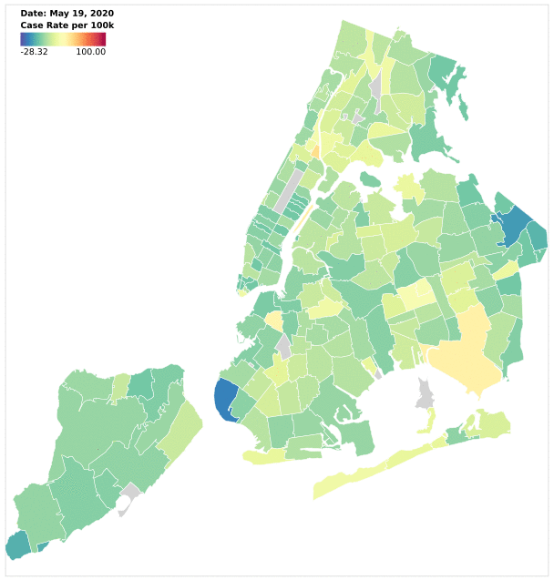

# CovidVisualization
Code for visualizing the NYC Health Department's Covid-19 data

## Animations

Here is an animation showing a plot of the change in Covid-19 case rates (per 100k people) as time varies from May 19th to June 21st:

