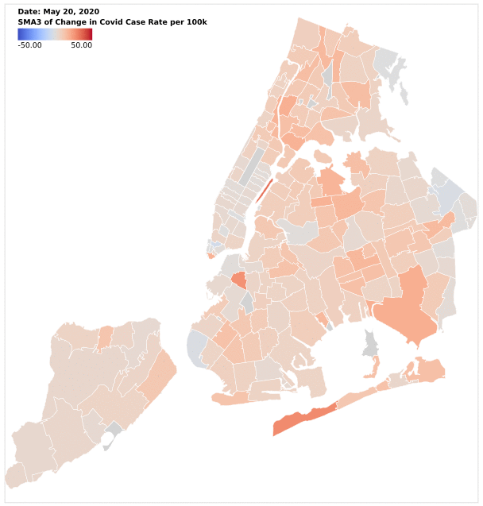
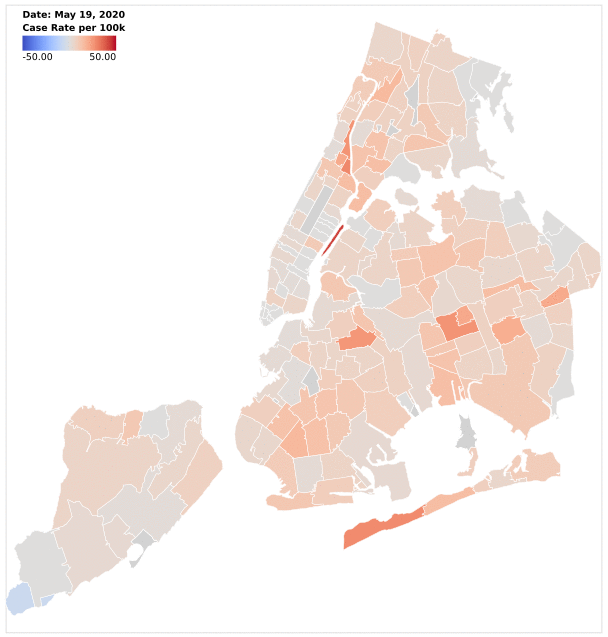

# CovidVisualization
Code for visualizing the NYC Health Department's [Covid-19 data](https://github.com/nychealth/coronavirus-data).

This repository contains some python functions (in *svg_utilities.py*) for producing svg maps to visualize Covid-19 data by zip code (or really NYC's "modified ZCTAs"). It uses the map available on the NYC Health Department's [Covid-19 data website](https://www1.nyc.gov/site/doh/covid/covid-19-data.page) as a template. It also contains code for cleaning up the NYC data (in *clean_data.py*).

## Animations

Here is an animation showing a plot of the 3-day (simple) moving average of the
rate of change in Covid-19 case rates (per 100k people) as time varies from May
20th to June 21st:

This animation allows us to see the localized spikes in Covid-19 cases.

Here instead is the rate itself (May 19–June 21), which is much noisier:

## Examples
The following files contain sample scripts for working with our svg and data cleaning utilities:

- *make_diff_svgs.py*: a script for plotting the day-to-day change in the rate (per 100k people) of Covid cases.
- *make_SMA_diff_svgs.py*: a script for plotting the (simple) moving average of day-to-day change in the rate (per 100k people) of Covid cases.

These are the files used to produce the svg images that went into the animations above. The gifs themselves were produced from the svg files using ImageMagick from the terminal like so:

    convert -delay 50 *.svg NYC_covid_diff_coolwarm_50.gif
